---
## Front matter
lang: ru-RU
title: Лабораторная работа №1
subtitle: "Установка и конфигурация операционной системы на виртуальную машину"
author:
  - Богданюк А.В., НКАбд-01-23
institute:
  - Российский университет дружбы народов, Москва, Россия
date: 22 февраля 2024

## i18n babel
babel-lang: russian
babel-otherlangs: english

## Formatting pdf
toc: false
toc-title: Содержание
slide_level: 2
aspectratio: 169
section-titles: true
theme: metropolis
header-includes:
 - \metroset{progressbar=frametitle,sectionpage=progressbar,numbering=fraction}
 - '\makeatletter'
 - '\beamer@ignorenonframefalse'
 - '\makeatother'
---

## Цель работы

Целью данной работы является приобретение практических навыков установки операционной системы на виртуальную машину, настройки минимально необходимых для дальнейшей работы сервисов.

## Задание

1. Установка и настройка операционной системы.
2. Домашнее задание.
3. Ответы на вопросы.

## Выполнение лабораторной работы

Для начала создаю новую виртуальную машину в VirtualBox, выбираю имя avbogdanyuk. Образ iso скачиваю с официально сайта Rocky DVD (рис. 1).

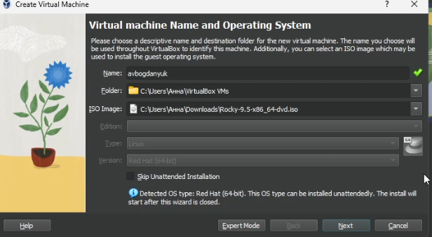{#fig:001 width=70%}

## Выполнение лабораторной работы

Затем выставляю память 2048 MB, процессор 3(рис. 2).

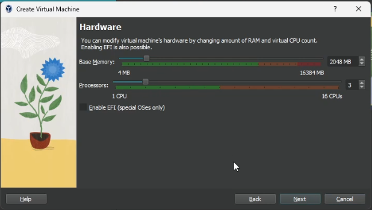{#fig:002 width=70%}

## Выполнение лабораторной работы

Теперь выделяю 40 Гб памяти на виртуальном жестком диске (рис. 3).

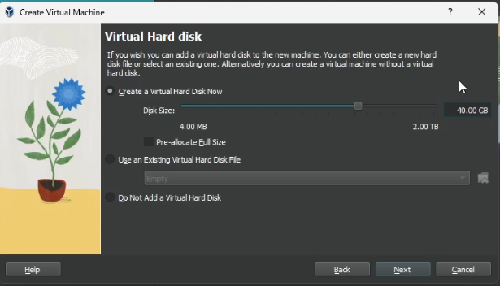{#fig:003 width=70%}

## Выполнение лабораторной работы

Затем подключаю образ диска (рис. 4).

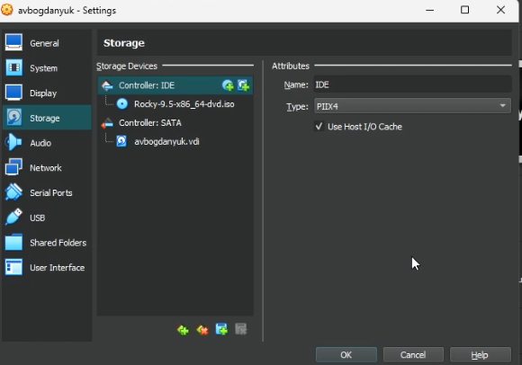{#fig:004 width=70%}

## Выполнение лабораторной работы

Загрузка ОС (рис. 5).

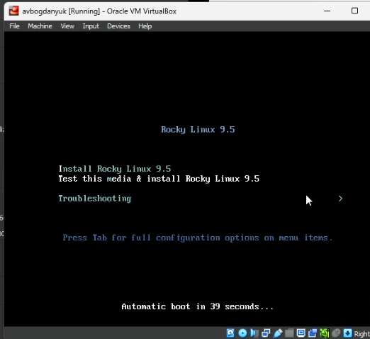{#fig:005 width=70%}

## Выполнение лабораторной работы

Ставлю язык установки (рис. 6).

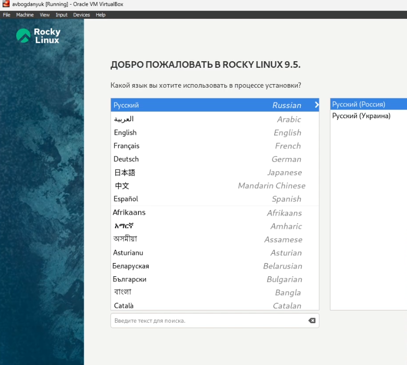{#fig:006 width=70%}

## Выполнение лабораторной работы

Ставлю регион/часовой пояс (рис. 7).

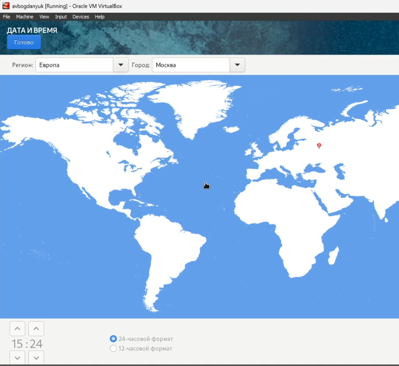{#fig:007 width=70%}

## Выполнение лабораторной работы

Устанавливаем пароль для администратора (рис. 8).

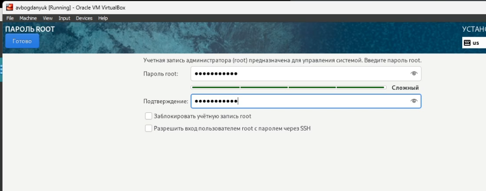{#fig:008 width=70%}

## Выполнение лабораторной работы

Устанавливаем имя пользователя и пароль (рис. 9).

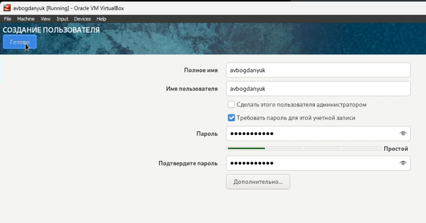{#fig:009 width=70%}

## Выполнение лабораторной работы

Выбираю сервер с GUI И средства разработки в дополнительном прогрммном обеспечении (рис. 10).

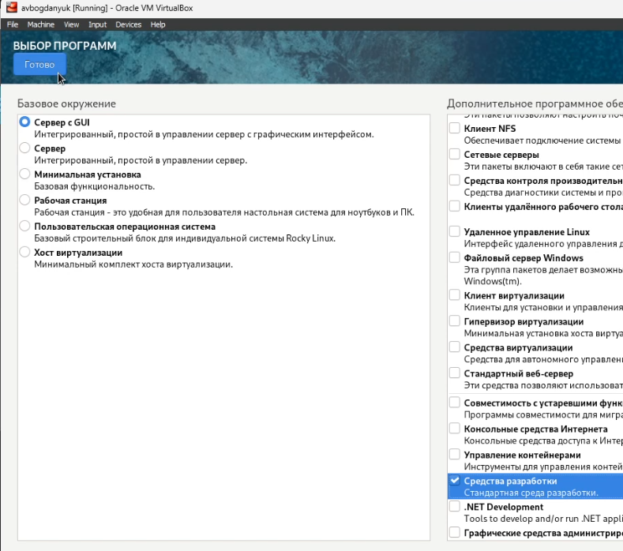{#fig:010 width=70%}

## Выполнение лабораторной работы

Устанавливаем (рис. 11).

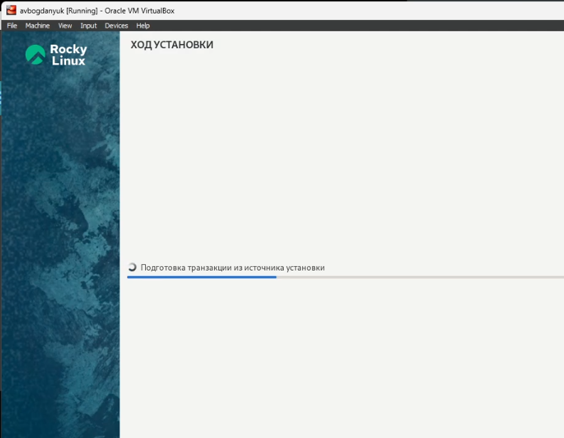{#fig:011 width=70%}

## Выполнение лабораторной работы

Всё успешно установилось (рис. 12).

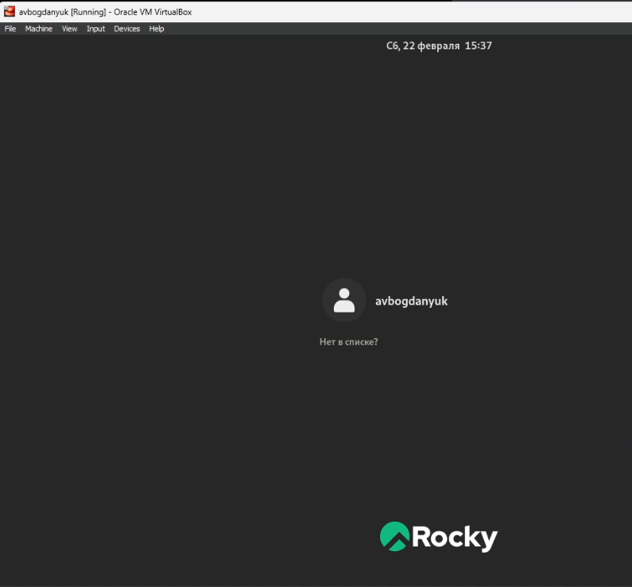{#fig:012 width=70%}

## Выполнение лабораторной работы

Версия ядра 5.14.0-503.14.1.el9_5.x86_64 (рис. 13).

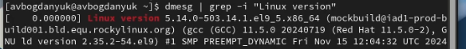{#fig:013 width=70%}

## Выполнение лабораторной работы

Частота процессора 2495.998 MHz (рис. 14).

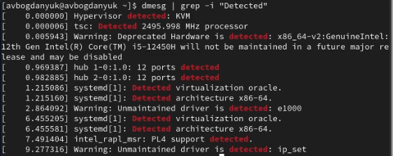{#fig:014 width=70%}

## Выполнение лабораторной работы

Модель процессора (рис. 15).

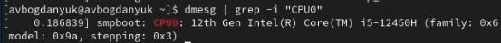{#fig:015 width=70%}

## Выполнение лабораторной работы

Доступная память (рис. 16).

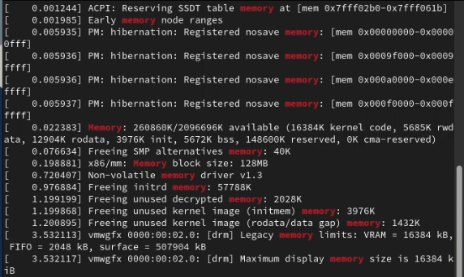{#fig:016 width=70%}

## Выполнение лабораторной работы

Гипервизор типа KVM (рис. 17).

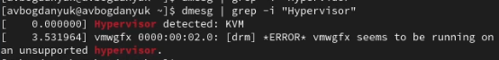{#fig:017 width=70%}

## Выполнение лабораторной работы

Монтированая файловая система (рис. 18).

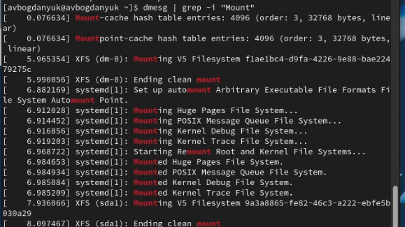{#fig:018 width=70%}

## Вывод

В ходе выполнения лабораторной работы были приобретены практические навыки устрановки ОС на вирутальную машину, настройки манимально необходимых для дальнешей работы сервисов.

## Список литературы{.unnumbered}

::: {#refs}
1. Dash P. Getting started with oracle vm virtualbox. Packt Publishing Ltd, 2013. 86 p.
2. Colvin H. Virtualbox: An ultimate guide book on virtualization with virtualbox. CreateSpace Independent Publishing Platform, 2015. 70 p.
3. van Vugt S. Red hat rhcsa/rhce 7 cert guide : Red hat enterprise linux 7 (ex200 and ex300). Pearson IT Certification, 2016. 1008 p.
4. Робачевский А., Немнюгин С., Стесик О. Операционная система unix. 2-е изд. Санкт-Петербург: БХВ-Петербург, 2010. 656 p.
5. Немет Э. et al. Unix и Linux: руководство системного администратора. 4-е изд. Вильямс, 2014. 1312 p.
6. Колисниченко Д.Н. Самоучитель системного администратора Linux. СПб.: БХВ-Петербург, 2011. 544 p.
7. Robbins A. Bash pocket reference. O’Reilly Media, 2016. 156 p.
:::