---
## Front matter
title: "Лабораторная работа 1"
subtitle: "Установка и конфигурация операционной системы на виртуальную машину"
author: "Богданюк Анна Васильевна"

## Generic otions
lang: ru-RU
toc-title: "Содержание"

## Bibliography
bibliography: bib/cite.bib
csl: pandoc/csl/gost-r-7-0-5-2008-numeric.csl

## Pdf output format
toc: true # Table of contents
toc-depth: 2
lof: true # List of figures
lot: true # List of tables
fontsize: 12pt
linestretch: 1.5
papersize: a4
documentclass: scrreprt
## I18n polyglossia
polyglossia-lang:
  name: russian
  options:
	- spelling=modern
	- babelshorthands=true
polyglossia-otherlangs:
  name: english
## I18n babel
babel-lang: russian
babel-otherlangs: english
## Fonts
mainfont: PT Mono
romanfont: PT Mono
sansfont: PT Mono
monofont: PT Mono
mainfontoptions: Ligatures=TeX
romanfontoptions: Ligatures=TeX
sansfontoptions: Ligatures=TeX,Scale=MatchLowercase
monofontoptions: Scale=MatchLowercase,Scale=0.9
## Biblatex
biblatex: true
biblio-style: "gost-numeric"
biblatexoptions:
  - parentracker=true
  - backend=biber
  - hyperref=auto
  - language=auto
  - autolang=other*
  - citestyle=gost-numeric
## Pandoc-crossref LaTeX customization
figureTitle: "Рис."
tableTitle: "Таблица"
listingTitle: "Листинг"
lofTitle: "Список иллюстраций"
lotTitle: "Список таблиц"
lolTitle: "Листинги"
## Misc options
indent: true
header-includes:
  - \usepackage{indentfirst}
  - \usepackage{float} # keep figures where there are in the text
  - \floatplacement{figure}{H} # keep figures where there are in the text
---

# Цель работы

Целью данной работы является приобретение практических навыков установки операционной системы на виртуальную машину, настройки минимально необходимых для дальнейшей работы сервисов.

# Задание

1. Установка и настройка операционной системы.
2. Домашнее задание
3. Ответы на вопросы

# Теоретическое введение

Лабораторная работа подразумевает установку на виртуальную машину VirtualBox (https://www.virtualbox.org/) операционной системы Linux (дистрибутив Rocky (https://rockylinux.org/)). Выполнение работы возможно как в дисплейном классе факультета физико-математических и естественных наук РУДН, так и дома. Описание выполнения работы приведено для дисплейного класса со следующими характеристиками:
– Intel Core i3-550 3.2 GHz, 4 GB оперативной памяти, 20 GB свободного
места на жёстком диске;
– ОС Linux Gentoo (http://www.gentoo.ru/);
– VirtualBox верс. 6.1 или старше;
– каталог с образами ОС для работающих в дисплейном классе:
/afs/dk.sci.pfu.edu.ru/common/files/iso/.

# Выполнение лабораторной работы

Для начала создаю новую виртуальную машину в VirtualBox, выбираю имя avbogdanyuk. Образ iso скачиваю с официально сайта Rocky DVD (рис. 1).

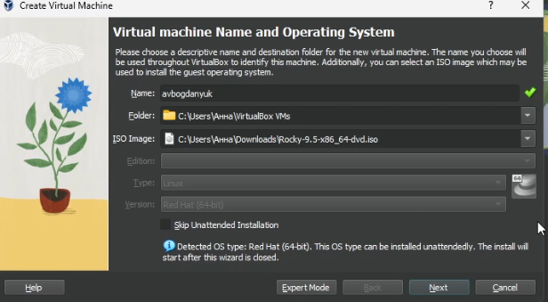{#fig:001 width=70%}

Затем выставляю память 2048 MB, процессор 3(рис. 2).

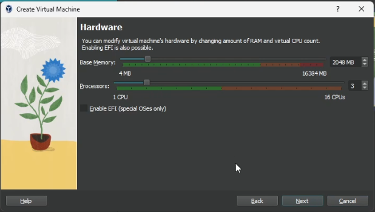{#fig:002 width=70%}

Теперь выделяю 40 Гб памяти на виртуальном жестком диске (рис. 3).

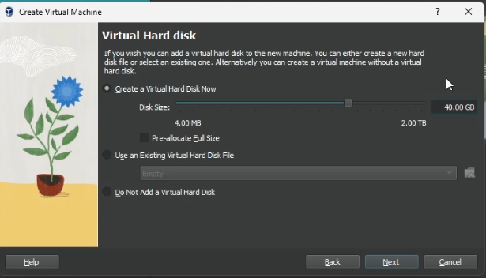{#fig:003 width=70%}

Затем подключаю образ диска (рис. 4).

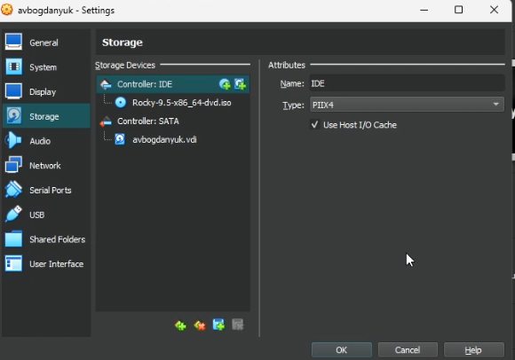{#fig:004 width=70%}

Загрузка ОС (рис. 5).

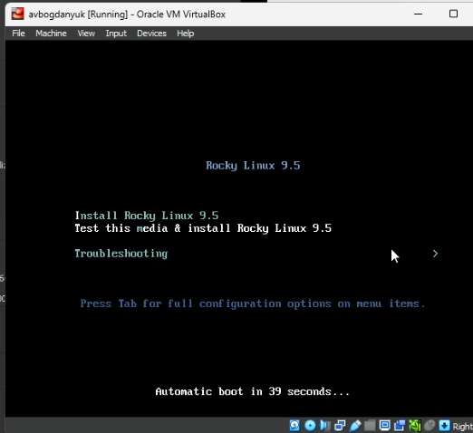{#fig:005 width=70%}

Ставлю язык установки (рис. 6).

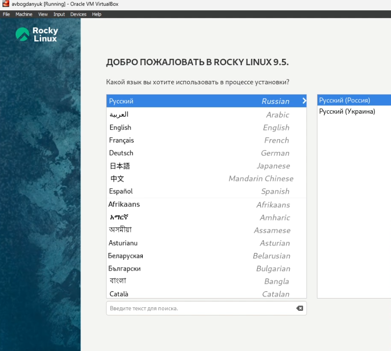{#fig:006 width=70%}

Ставлю регион/часовой пояс (рис. 7).

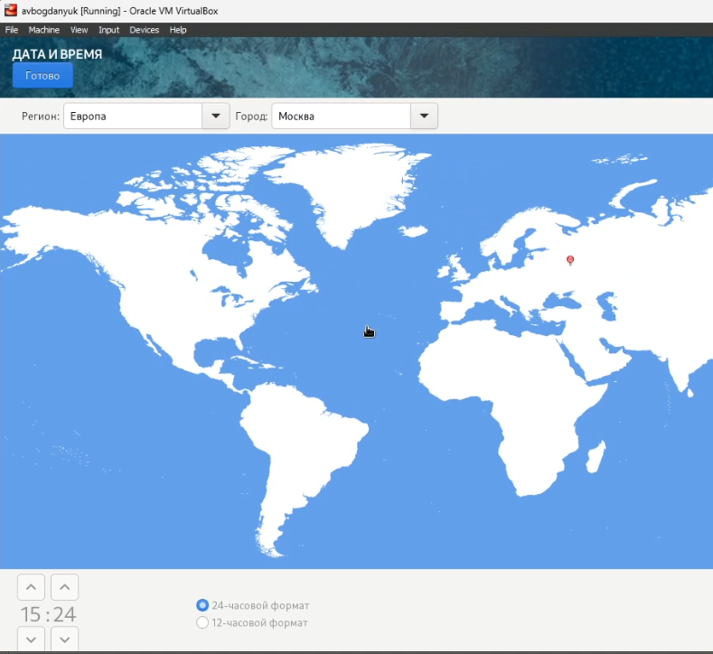{#fig:007 width=70%}

Устанавливаем пароль для администратора (рис. 8).

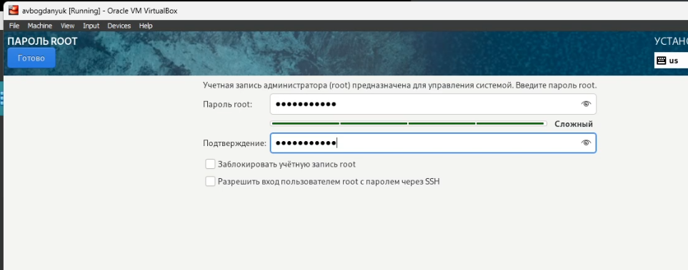{#fig:008 width=70%}

Устанавливаем имя пользователя и пароль (рис. 9).

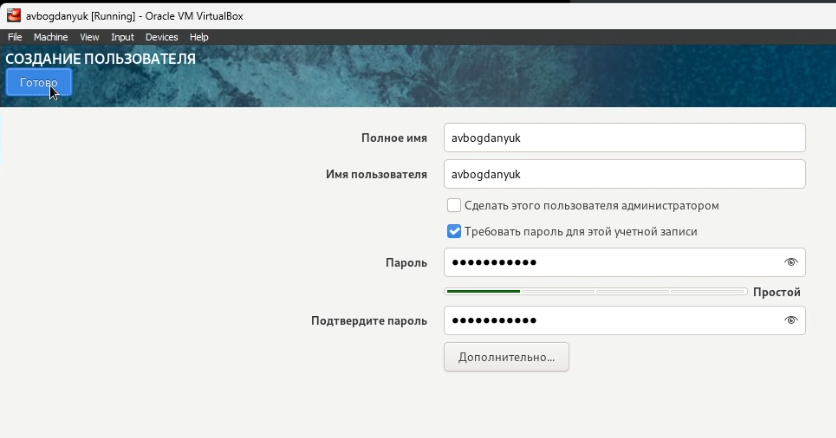{#fig:009 width=70%}

Выбираю сервер с GUI И средства разработки в дополнительном прогрммном обеспечении (рис. 10).

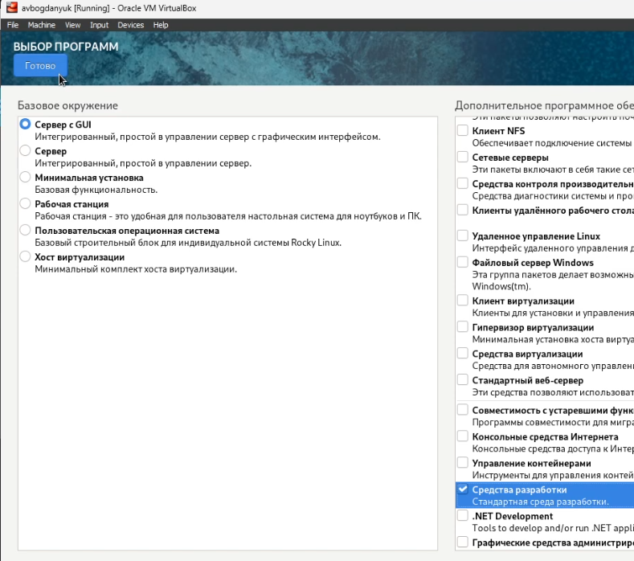{#fig:010 width=70%}

Устанавливаем (рис. 11).

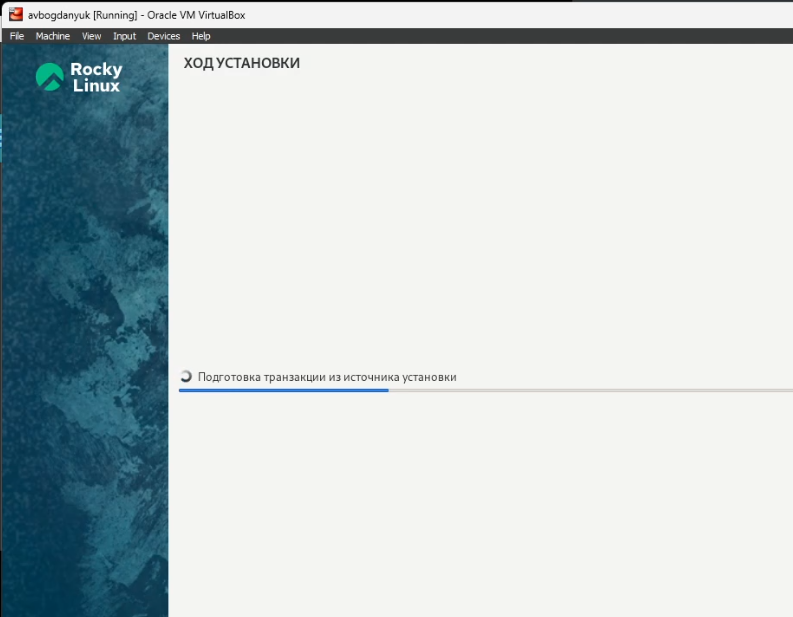{#fig:011 width=70%}

Всё успешно установилось (рис. 12).

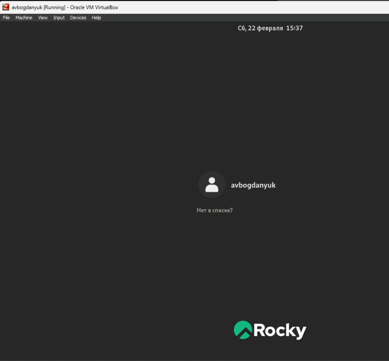{#fig:012 width=70%}

Версия ядра 5.14.0-503.14.1.el9_5.x86_64 (рис. 13).

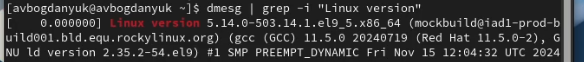{#fig:013 width=70%}

Частота процессора 2495.998 MHz (рис. 14).

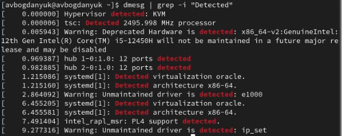{#fig:014 width=70%}

Модель процессора (рис. 15).

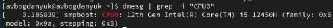{#fig:015 width=70%}

Доступная память (рис. 16).

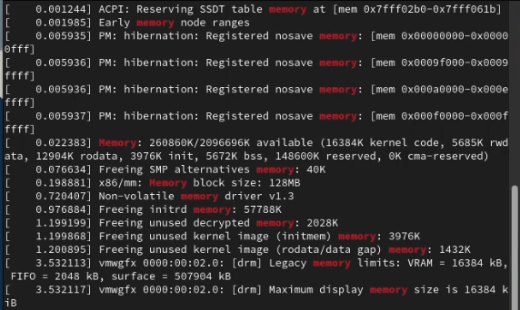{#fig:016 width=70%}

Гипервизор типа KVM (рис. 17).

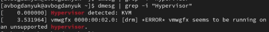{#fig:017 width=70%}

Монтированая файловая система (рис. 18).

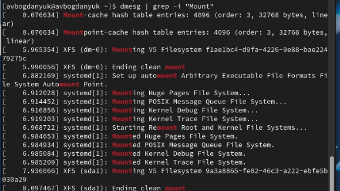{#fig:018 width=70%}

# Ответы на контрольные вопросы

1. Учетная запись содержит необходимые для идентификации пользователя при подключении к системе данные, а так же информацию для авторизации и учета: системного имени (user name) (оно может содержать только латинские буквы и знак нижнее подчеркивание, еще оно должно быть уникальным), идентификатор пользователя (UID) (уникальный идентификатор пользователя в системе, целое положительное число), идентификатор группы (CID) (группа, к к-рой относится пользователь. Она, как минимум, одна, по умолчанию - одна), полное имя (full name) (Могут быть ФИО), домашний каталог (home directory) (каталог, в к-рый попадает пользователь после входа в систему и в к-ром хранятся его данные), начальная оболочка (login shell) (командная оболочка, к-рая запускается при входе в систему).

2. Для получения справки по команде: <команда> —help; для перемещения по файловой системе - cd; для просмотра содержимого каталога - ls; для определения объёма каталога - du <имя каталога>; для создания / удаления каталогов - mkdir/rmdir; для создания / удаления файлов - touch/rm; для задания определённых прав на файл / каталог - chmod; для просмотра истории команд - history

3. Файловая система - это порядок, определяющий способ организации и хранения и именования данных на различных носителях информации. Примеры: FAT32 представляет собой пространство, разделенное на три части: олна область для служебных структур, форма указателей в виде таблиц и зона для хранения самих файлов. ext3/ext4 - журналируемая файловая система, используемая в основном в ОС с ядром Linux.

4. С помощью команды df, введя ее в терминале. Это утилита, которая показывает список всех файловых систем по именам устройств, сообщает их размер и данные о памяти. Также посмотреть подмонтированные файловые системы можно с помощью утилиты mount.

5. Чтобы удалить зависший процесс, вначале мы должны узнать, какой у него id: используем команду ps. Далее в терминале вводим команду kill < id процесса >. Или можно использовать утилиту killall, что "убьет" все процессы, которые есть в данный момент, для этого не нужно знать id процесса. 

# Выводы

В ходе выполнения лабораторной работы были приобретены практические навыки устрановки ОС на вирутальную машину, настройки манимально необходимых для дальнешей работы сервисов.
