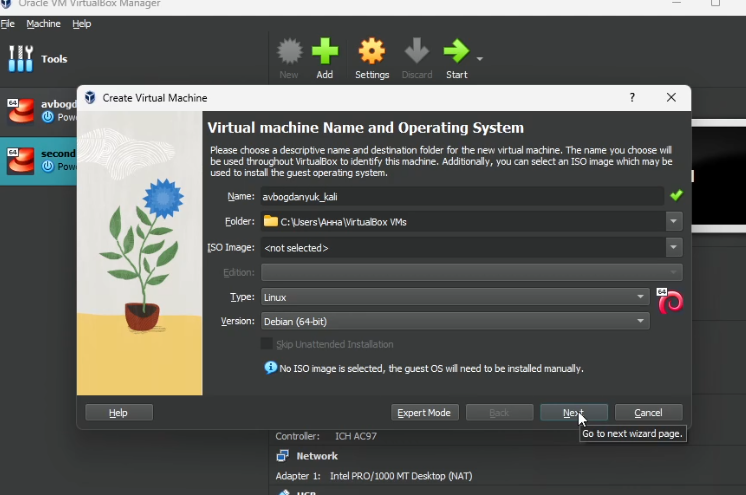
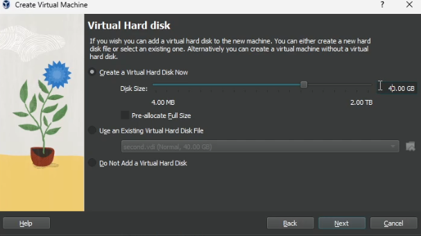
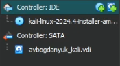

---
## Front matter
title: "Индивидуальный проект. Этап 1"
subtitle: "Установка Kali Linux"
author: "Богданюк Анна Васильевна"

## Generic otions
lang: ru-RU
toc-title: "Содержание"

## Bibliography
bibliography: bib/cite.bib
csl: pandoc/csl/gost-r-7-0-5-2008-numeric.csl

## Pdf output format
toc: true # Table of contents
toc-depth: 2
lof: true # List of figures
lot: true # List of tables
fontsize: 12pt
linestretch: 1.5
papersize: a4
documentclass: scrreprt
## I18n polyglossia
polyglossia-lang:
  name: russian
  options:
	- spelling=modern
	- babelshorthands=true
polyglossia-otherlangs:
  name: english
## I18n babel
babel-lang: russian
babel-otherlangs: english
## Fonts
mainfont: PT Mono
romanfont: PT Mono
sansfont: PT Mono
monofont: PT Mono
mainfontoptions: Ligatures=TeX
romanfontoptions: Ligatures=TeX
sansfontoptions: Ligatures=TeX,Scale=MatchLowercase
monofontoptions: Scale=MatchLowercase,Scale=0.9
## Biblatex
biblatex: true
biblio-style: "gost-numeric"
biblatexoptions:
  - parentracker=true
  - backend=biber
  - hyperref=auto
  - language=auto
  - autolang=other*
  - citestyle=gost-numeric
## Pandoc-crossref LaTeX customization
figureTitle: "Рис."
tableTitle: "Таблица"
listingTitle: "Листинг"
lofTitle: "Список иллюстраций"
lotTitle: "Список таблиц"
lolTitle: "Листинги"
## Misc options
indent: true
header-includes:
  - \usepackage{indentfirst}
  - \usepackage{float} # keep figures where there are in the text
  - \floatplacement{figure}{H} # keep figures where there are in the text
---

# Цель работы

Научиться основным способам тестирования веб приложений.

# Задание

1. Установить дистрибутив Kali Linux в виртуальную машину.

# Теоретическое введение

Операционная система — это комплекс программ, предназначенных для управления ресурсами компьютера и организации взаимодействия с пользователем.

Права доступа определяют, какие действия конкретный пользователь может или не может совершать с определенным файлами и каталогами. С помощью разрешений можно создать надежную среду — такую, в которой никто не может поменять содержимое ваших документов или повредить системные файлы.

# Выполнение лабораторной работы

Скачиваю с сайта Kali Linux Installer Image iso (рис. 1).

{#fig:001 width=70%}

Создаю новую виртуальную машину, называю её avbogdanyuk_kali, тип ОС Linux, версию Debian (64-bit) (рис. 2).

{#fig:002 width=70%}

Настраиваю основную память и количество процессоров (рис. 3).

{#fig:003 width=70%}

Настраиваю размер виртуального жесткого диска (рис. 4).

{#fig:004 width=70%}

Подключаю ранее скаченный образ диска (рис. 5).

{#fig:005 width=70%}

Устанавливаю Kali Linux (рис. 6).

{#fig:006 width=70%}

Успешно получилось всё установить (рис. 7).

{#fig:007 width=70%}

# Выводы

Установила дистрибутив Kali Linux в виртуальную машину.
