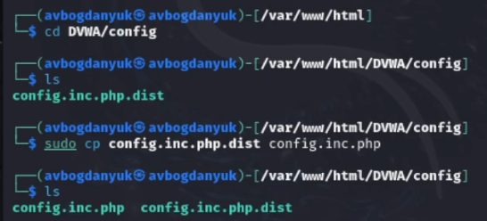
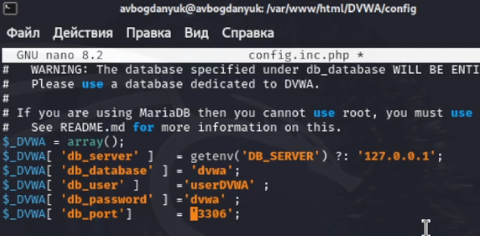
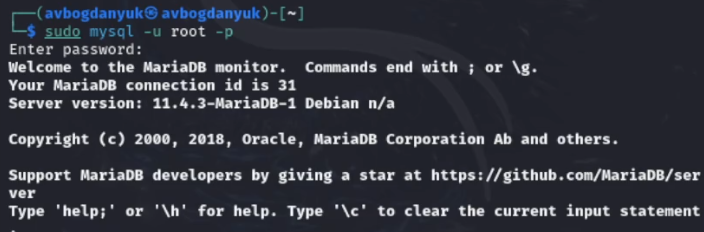
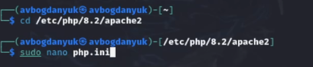

---
## Front matter
lang: ru-RU
title: Индивидуальный проект. Этап 2
subtitle: "Установка Kali Linux"
author:
  - Богданюк А.В., НКАбд-01-23
institute:
  - Российский университет дружбы народов, Москва, Россия
date: 21 марта 2025

## i18n babel
babel-lang: russian
babel-otherlangs: english

## Formatting pdf
toc: false
toc-title: Содержание
slide_level: 2
aspectratio: 169
section-titles: true
theme: metropolis
header-includes:
 - \metroset{progressbar=frametitle,sectionpage=progressbar,numbering=fraction}
 - '\makeatletter'
 - '\beamer@ignorenonframefalse'
 - '\makeatother'
---

## Цель работы

Установить DVWA в гостевую систему к Kali Linux.

## Задание

1. Установить DVWA в гостевую систему к Kali Linux.

## Выполнение лабораторной работы

Переходим в директорию /var/www/html, потому что настройка dvwa происходит на локальном хосте (рис. 1).

{#fig:001 width=70%}

## Выполнение лабораторной работы

Далее клонирую нужный репозиторий GitHub (рис. 2).

{#fig:002 width=70%}

## Выполнение лабораторной работы

Проверяю, чтобы всё склонировалось верно, затем повышаю права доступа к DVWA до 777 (рис. 3).

{#fig:003 width=70%}

## Выполнение лабораторной работы

Чтобы настроить DVWA, нужно перейти в каталог /dvwa/config, затем проверяю содержимое каталога. Создаем копию файла, используемого для настройки DVWA config.inc.php.dist с именем config.inc.php. (рис. 4).

{#fig:004 width=70%}

## Выполнение лабораторной работы

Далее открываю файл в текстовом редакторе и изменяю данные об имени пользователя и пароле (рис. 5).

{#fig:005 width=70%}

## Выполнение лабораторной работы

По умолчанию в Kali Linux установлен mysql, поэтому можно его запустить без предварительного скачивания, далее выполняю проверку, запущен ли процесс (рис. 6).

{#fig:006 width=70%}

## Выполнение лабораторной работы

Авторизируюсь в базе данных от имени пользователя root. Появляется командная строка с приглашением “MariaDB”, далее создаем в ней нового пользователя, используя учетные данные из файла config.inc.php (рис. 7).

{#fig:007 width=70%}

## Выполнение лабораторной работы

Необходимо настроить сервер apache2, перехожу в соответствующую директорию. В файле php.ini нужно будет изменить один параметр, поэтому открываю файл в текстовом редакторе (рис. 8).

{#fig:008 width=70%}

## Выполнение лабораторной работы

Запускаем службу веб-сервера apache и проверяем, запущена ли служба (рис. 9).

{#fig:009 width=70%}

## Вывод

В ходе выполнения лабораторной работы была установлена DVWA в гостевую систему к Kali Linux.

## Список литературы{.unnumbered}

::: {#refs}
1. Dash P. Getting started with oracle vm virtualbox. Packt Publishing Ltd, 2013. 86 p.
2. Colvin H. Virtualbox: An ultimate guide book on virtualization with virtualbox. CreateSpace Independent Publishing Platform, 2015. 70 p.
3. van Vugt S. Red hat rhcsa/rhce 7 cert guide : Red hat enterprise linux 7 (ex200 and ex300). Pearson IT Certification, 2016. 1008 p.
4. Робачевский А., Немнюгин С., Стесик О. Операционная система unix. 2-е изд. Санкт-Петербург: БХВ-Петербург, 2010. 656 p.
5. Немет Э. et al. Unix и Linux: руководство системного администратора. 4-е изд. Вильямс, 2014. 1312 p.
6. Колисниченко Д.Н. Самоучитель системного администратора Linux. СПб.: БХВ-Петербург, 2011. 544 p.
7. Robbins A. Bash pocket reference. O’Reilly Media, 2016. 156 p.
:::