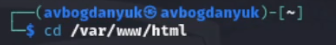
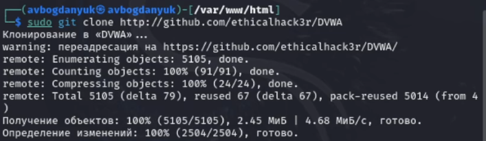
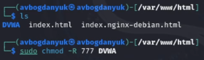
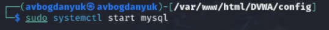
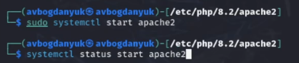

---
## Front matter
title: "Индивидуальный проект. Этап 2"
subtitle: "Установка DVWA"
author: "Богданюк Анна Васильевна"

## Generic otions
lang: ru-RU
toc-title: "Содержание"

## Bibliography
bibliography: bib/cite.bib
csl: pandoc/csl/gost-r-7-0-5-2008-numeric.csl

## Pdf output format
toc: true # Table of contents
toc-depth: 2
lof: true # List of figures
lot: true # List of tables
fontsize: 12pt
linestretch: 1.5
papersize: a4
documentclass: scrreprt
## I18n polyglossia
polyglossia-lang:
  name: russian
  options:
	- spelling=modern
	- babelshorthands=true
polyglossia-otherlangs:
  name: english
## I18n babel
babel-lang: russian
babel-otherlangs: english
## Fonts
mainfont: PT Mono
romanfont: PT Mono
sansfont: PT Mono
monofont: PT Mono
mainfontoptions: Ligatures=TeX
romanfontoptions: Ligatures=TeX
sansfontoptions: Ligatures=TeX,Scale=MatchLowercase
monofontoptions: Scale=MatchLowercase,Scale=0.9
## Biblatex
biblatex: true
biblio-style: "gost-numeric"
biblatexoptions:
  - parentracker=true
  - backend=biber
  - hyperref=auto
  - language=auto
  - autolang=other*
  - citestyle=gost-numeric
## Pandoc-crossref LaTeX customization
figureTitle: "Рис."
tableTitle: "Таблица"
listingTitle: "Листинг"
lofTitle: "Список иллюстраций"
lotTitle: "Список таблиц"
lolTitle: "Листинги"
## Misc options
indent: true
header-includes:
  - \usepackage{indentfirst}
  - \usepackage{float} # keep figures where there are in the text
  - \floatplacement{figure}{H} # keep figures where there are in the text
---

# Цель работы

Установить DVWA в гостевую систему к Kali Linux.

# Задание

1. Установить DVWA в гостевую систему к Kali Linux.

# Теоретическое введение

Некоторые из уязвимостей веб приложений, который содержит DVWA:
- Брутфорс: Брутфорс HTTP формы страницы входа - используется для тестирования инструментов по атаке на пароль методом грубой силы и показывает небезопасность слабых паролей.
- Исполнение (внедрение) команд: Выполнение команд уровня операционной системы.
- Межсайтовая подделка запроса (CSRF): Позволяет «атакующему» изменить пароль администратора приложений.
- Внедрение (инклуд) файлов: Позволяет «атакующему» присоединить удалённые/локальные файлы в веб приложение.
-SQL внедрение: Позволяет «атакующему» внедрить SQL выражения в HTTP из поля ввода, DVWA включает слепое и основанное на ошибке SQL внедрение.
- Небезопасная выгрузка файлов: Позволяет «атакующему» выгрузить вредоносные файлы на веб сервер.
- Межсайтовый скриптинг (XSS): «Атакующий» может внедрить свои скрипты в веб приложение/базу данных. DVWA включает отражённую и хранимую XSS.
- Пасхальные яйца: раскрытие полных путей, обход аутентификации и некоторые другие.

DVWA имеет три уровня безопасности, они меняют уровень безопасности каждого веб приложения в DVWA:
1. Невозможный — этот уровень должен быть безопасным от всех уязвимостей. Он используется для сравнения уязвимого исходного кода с безопасным исходным кодом.
2. Высокий — это расширение среднего уровня сложности, со смесью более сложных или альтернативных плохих практик в попытке обезопасить код. Уязвимости не позволяют такой простор эксплуатации как на других уровнях.
3. Средний — этот уровень безопасности предназначен главным образом для того, чтобы дать пользователю пример плохих практик безопасности, где разработчик попытался сделать приложение безопасным, но потерпел неудачу.
4. Низкий — этот уровень безопасности совершенно уязвим и совсем не имеет защиты. Его предназначение быть примером среди уязвимых веб приложений, примером плохих практик программирования и служить платформой обучения базовым техникам эксплуатации.

# Выполнение лабораторной работы

Переходим в директорию /var/www/html, потому что настройка dvwa происходит на локальном хосте (рис. 1).

{#fig:001 width=70%}

Далее клонирую нужный репозиторий GitHub (рис. 2).

{#fig:002 width=70%}

Проверяю, чтобы всё склонировалось верно, затем повышаю права доступа к DVWA до 777 (рис. 3).

{#fig:003 width=70%}

Чтобы настроить DVWA, нужно перейти в каталог /dvwa/config, затем проверяю содержимое каталога. Создаем копию файла, используемого для настройки DVWA config.inc.php.dist с именем config.inc.php. (рис. 4).

{#fig:004 width=70%}

Далее открываю файл в текстовом редакторе и изменяю данные об имени пользователя и пароле (рис. 5).

{#fig:005 width=70%}

По умолчанию в Kali Linux установлен mysql, поэтому можно его запустить без предварительного скачивания, далее выполняю проверку, запущен ли процесс (рис. 6).

{#fig:006 width=70%}

Авторизируюсь в базе данных от имени пользователя root. Появляется командная строка с приглашением “MariaDB”, далее создаем в ней нового пользователя, используя учетные данные из файла config.inc.php (рис. 7).

{#fig:007 width=70%}

Необходимо настроить сервер apache2, перехожу в соответствующую директорию. В файле php.ini нужно будет изменить один параметр, поэтому открываю файл в текстовом редакторе (рис. 8).

{#fig:008 width=70%}

Запускаем службу веб-сервера apache и проверяем, запущена ли служба (рис. 9).

{#fig:009 width=70%}

# Выводы

В ходе выполнения лабораторной работы была установлена DVWA в гостевую систему к Kali Linux.
